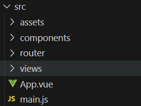
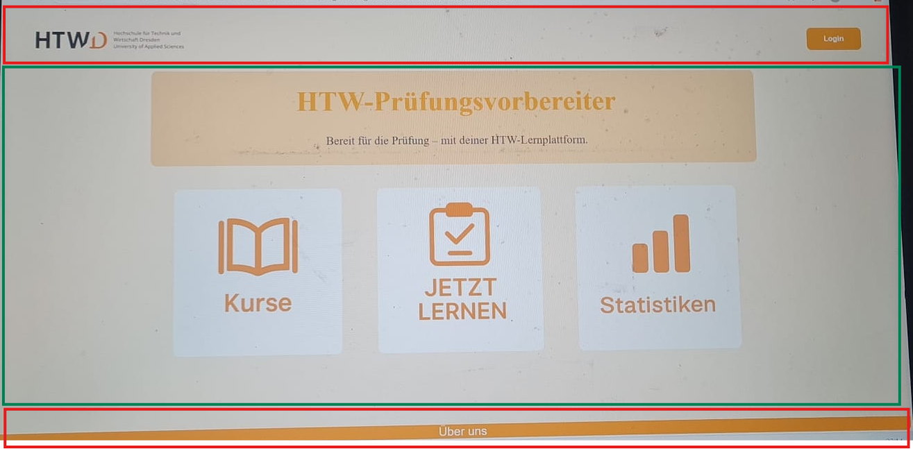

# Frontend

## Empfohlene VS Code Extension

[Volar](https://marketplace.visualstudio.com/items?itemName=Vue.volar) ist die von Vue.js selbst empfohlene VS Code Extension, die Installation ist also sehr sinnvoll.

## Konfigurationsreferenz

Für die Konfiguration von Vite (Webserver, der das Vue Projekt bereitstellt) kann in der [Vite Configuration Reference](https://vite.dev/config/) nachgelesen werden, wie man etwas konfiguriert.

## Projekt Einrichtung

Node.js ([Download-Link](https://nodejs.org/en/download)) installieren, nicht mit Docker, unten gibt es für Windows/MacOS einen Installer, Linux idealerweise mit dem Package Manager. Dann im Verzeichnis `frontend` den folgenden Befehl ausführen

```sh
npm install
```

### Compile and Hot-Reload for Development

Um für die Entwicklung einen Webserver zu starten den folgenden Befehl nutzen

```sh
npm run dev
```

Dieser Server lädt bei Speichern von Änderungen in Code automatisch die Änderungen direkt in die Webseite. Hot-Reload ist nicht immer perfekt, manchmal muss man auch einfach den Server neustarten.

### Compile and Minify for Production

Um das Projekt für das Deployment zu bauen, wird der folgende Befehl verwendet

```sh
npm run build
```

## Entwicklung

Als Ressourcen für die Entwicklung stehen von Vue [Vue Guide](https://vuejs.org/guide/introduction.html) für Vue allgemein und [Vue Router Guide](https://router.vuejs.org/guide/) für Vue Router zur Verfügung.
Zusätzlich ist im bereits erstellten Basis Projekt ein kleines Beispiel zu sehen, wie man Vue und Vue Router verwendet.

## Achitekturielle Herangehensweise

Das Frontend ist, wie im Verzeichnis `frontend/src` zu sehen, in 4 Ordner unterteilt.



In `assets` werden statische Dateien (z.B. Stylesheets oder Bilder) abgelegt, welche innerhalb der Web-App genutzt werden.
Diese kann man dann mittels `@/assets/<Dateiname>` verwenden.
Hier ist zu beachten, dass diese Dateien "minified" und gebündelt, also vorverarbeitet werden.
Das hat zur Folge, dass die Namen der Dateien in der Web-App andere sind, als im Verzeichnis.
Das ist nur dann relevant, wenn man den tatsächlichen Namen für etwas benötigt, bspw. wenn man etwas als Download anbieten würde.
Es kann auch sein, wenn man hier ein Skript speichert, welches eine bestimmt Bibliothek verwendet, dass diese Bibliothek dann nicht korrekt funktioniert.
In so einem Fall muss man auf den Ordner `frontend/public` zurückgreifen.
Hier müssen die Dateien mit absoluten Pfad angegeben werden z.B. `/favicon.ico`.

In `components` werden .vue-Dateien abgelegt, die einzelne, wiederverwendbare Komponenten darstellen.
Diese Komponenten können Variablen bekommen, um dynamischer zu werden.
Hier würde man also als Beispiel eine Karteikarte als Komponente erstellen.

In `router` liegt die Datei `router.js`.
In dieser wird eingestellt welche View zu sehen ist, wenn eine bestimmte URL angesteuert wird.
Wenn man also eine View angelegt hat, muss diese Datei angepasst werden.

In `views` liegen die .vue-Dateien, die ganze Views beschreiben.
Hier würde man also die Startseite, die Ansicht zum Lernen mit Karteikarten oder Ähnliches erstellen.
Der Name der .vue-Datei, wird dann in `router.js` benötigt, um die URL einstellen zu können.

Die Datei `App.vue` ist die Hauptdatei der Web-App.
Hier wird also der Startpunkt und der Rahmen der App definiert.

Die Datei `main.js` ist das Startskript der App, hier wird das App-Objekt initialisiert.

### Explizites Beispiel

Als explizites Beispiel an der Startseite würde es entsprechend so aussehen, dass das rot markierte in der `App.vue` zu finden ist, da der Header und Footer über alle Views gleich ist.
Dazwischen wird in der `App.vue` dann nur `<RouterView />` als Tag eingebunden.

Das grün markierte würde als View in `views` mit dem Namen `StartseiteView.vue` erstellt und in `router.js` für die URL `/` eingebunden werden.

Ein Button könnte dann mittels 
```html
<RouterLink to="/lernen" tag="Button">Button-Inhalt</RouterLink>
```
erstellt werden, wenn beim Klick auf diesen auf die View, die unter `/lernen` in dem Router eingestellt ist, gewechselt werden soll.